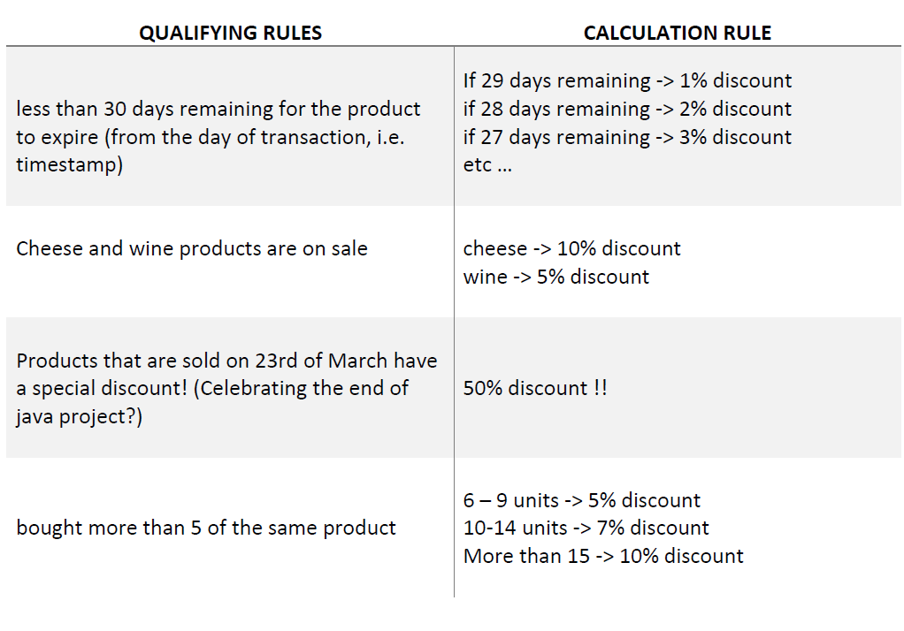

# Retail-Store-Discount-Calculator-With-Scala
    Retail Store Discount Calculator with Scala using functional programming paradigm that qualifies orders’ transactions to discounts based on a set of qualifying rules. And automatically calculates the proper discount based on some calculation rules as follow : 

- Transactions that didn’t qualify to any discount will have 0% discount.
- Transactions that qualified to more than one discount will get the top 2 and get their
average.