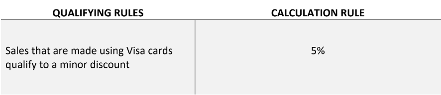

# Retail-Store-Discount-Calculator-With-Scala
Retail Store Discount Calculator with Scala using functional programming paradigm that qualifies orders’ transactions to discounts based on a set of qualifying rules. And automatically calculates the proper discount based on some calculation rules as follow : 

- Transactions that didn’t qualify to any discount will have 0% discount.
- Transactions that qualified to more than one discount will get the top 2 and get their
average.

---
## Implemented Functions
- Defines various discount functions:
  - `checkExpire`: Checks if a product is about to expire.
  - `expireDiscount`: Calculates discount for expiring products.
  - `checkCategory`: Checks if a product belongs to a specific category.
  - `categoryDiscount`: Calculates discount for specific categories of products.
  - `checkHoliday`: Checks if it's a holiday.
  - `holidayDiscount`: Calculates discount for holidays.
  - `checkQuantity`: Checks quantity of product.
  - `quantityDiscount`: Calculates discount based on product quantity.
  - `checkChannel`: Checks the channel of purchase.
  - `channelDiscount`: Calculates discount based on the purchase channel.
  - `checkPaymentMethod`: Checks the payment method.
  - `paymentMethodDiscount`: Calculates discount based on payment method.
# Setup and Usage

### Prerequisites

Before using this repository, ensure you have the following installed:

- [Scala](https://www.scala-lang.org/download/)
- [JDK](https://www.oracle.com/java/technologies/javase-jdk11-downloads.html)

- Oracle Database installed and running.
- Ensure that the JDBC driver for Oracle is available in your project's dependencies.